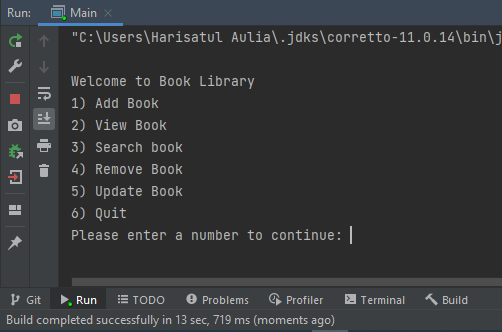
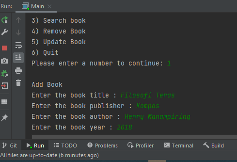
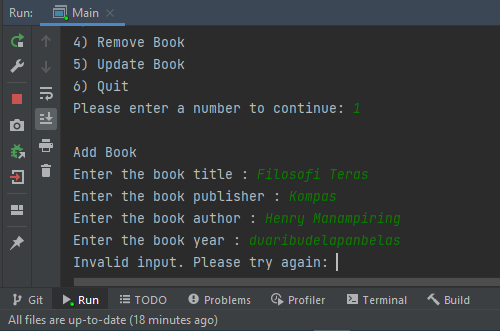
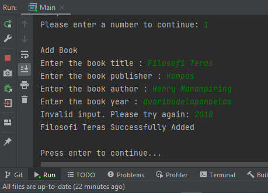

# Java Crud
## _Simple implementation of Crud in Java_

library console app to store book data. implements simple crud and clean code principles.

## Features

- Add Book
- View Book
- Search Book (by book Tittle)
- Remove Book
- Update Book

## Main Menu

This is main menu. There are five sub-menu to be chosen.
Input the number that you want to choose.

## Add Book

There are four fields that should be filled.
    - `title` Book title should be String.
    - `publisher` Book publisher should be String.
    - `author` Book author should be String.
    - `year` Book year should be the number.

Make sure you type it correctly. Otherwise, you'll meet `invalid-message` .

Type it again with right input. Then, program will be happy.

Finally, Book has been added. The program will give you `success-message`

## View Book

